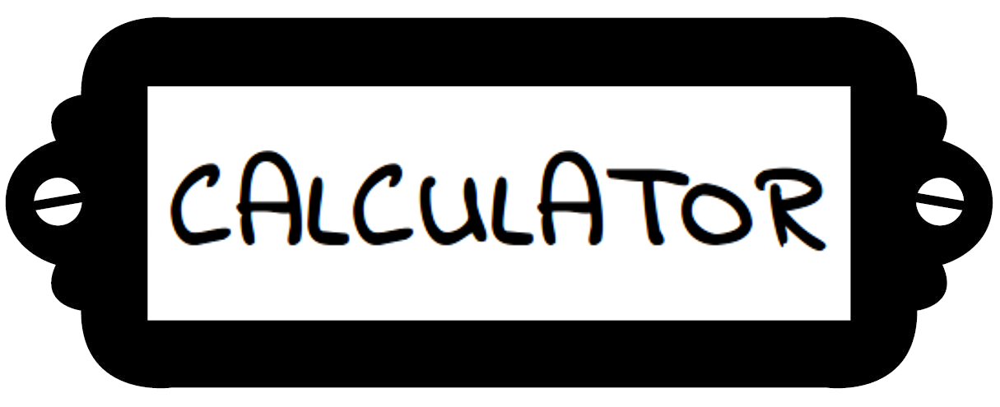

#**My Page for Spider Webdev Inductions**
---

---
This page was made as part of the first task of Spider Inductions.  
It is also my first attempt at making a webpage.  
Hope you like it!
 
##**The HTML**
---
####**Title: Task1**
-   [About](#about) 
-   [Calculator](#calc)
---
OLA!  
I'm **J.M. SOORYA NARAYAN** and here's something I've been working on
* [Home](#top)
* [About](#about)
* [Calculator](#calc)

---
### Section about me
  

---
>Hi, I'm Soorya. Nice to meet you.  
>I'm a first(second? ) year CSE student at NIT, Trichy. A Tamilian born  
in Chennai, I've lived all my life in the Middle East (mostly Qatar).  
>I love art and music. I paint and like to dabble around with the piano.  
(You can catch some of my paintings
[here](https://www.facebook.com/soorya.narayan.5/media_set?set=a.494123780598551.112245.100000027992804&type=3)
and
[here](https://www.facebook.com/soorya.narayan.5/media_set?set=a.212606398750292.55399.100000027992804&type=3)).
I like to read and am a huge anime fan too. I'm also a part of the  
content teams for Festember and Bits 'n Bytes.  
>As far as my webdev experience is concerned, I'm new to it and am  
wondering what took me so long to get to it (Javascript in particular is  
awesome!).  
>If you want to ping me or stalk me (It's ok, I don't judge), there's  
always [facebook](https://www.facebook.com/soorya.narayan.5)

---

### The calculator
Use the calculator like any other. Only a couple of things to keep in
mind.  
1. To evaluate +,\*,/,-, click on '=' button.
2. To evaluate other functions click on the operation itself.
 eg. to evaluate sin(5), simply click on sin, not '='.

7 8 9  
4 5 6  
1 2 3  
. 0 =
####main operators
DEL ÷ x - + CLR
####The extra functions
x^2 x^3 sin cos tan x!

---

---
##**The Javascript** 
There are two javascript files as part of the webpage:
1. clac.js: _script responsible for the functioning of the calculator_
2. tabs.js: _script for scrollable sticky nav and changing of calculator from normal to scientific_
---
___
##**The CSS**
Again there are two main style sheets responsible for the look of the page:
1. calc.css: _the style and scalability of the lolipop calculator_
2. tabs.css: _the style of the rest of the webpage_

There is also a stylesheet from the google fonts api for the [indie flower font](https://www.google.com/fonts/specimen/Indie+Flower)

---

---
###Screenshots
* 
* 
